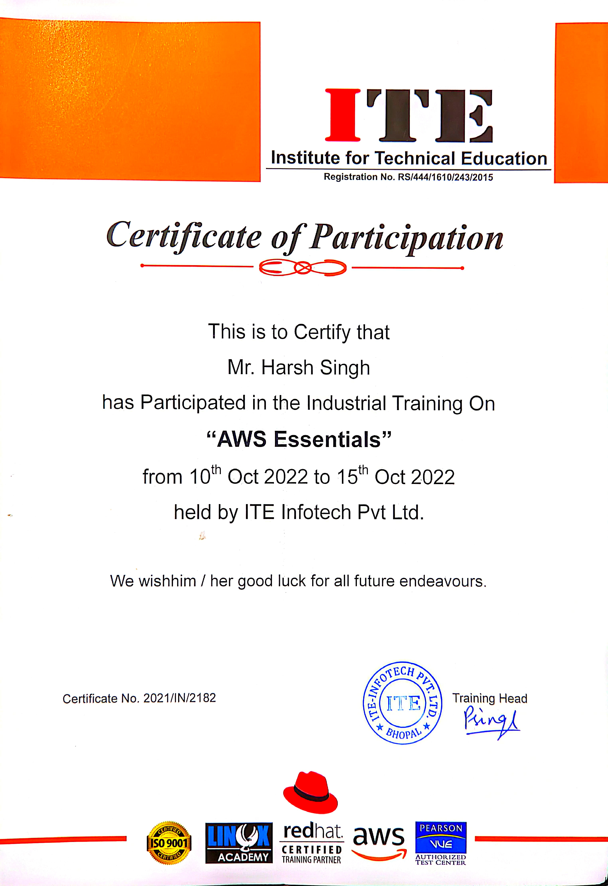
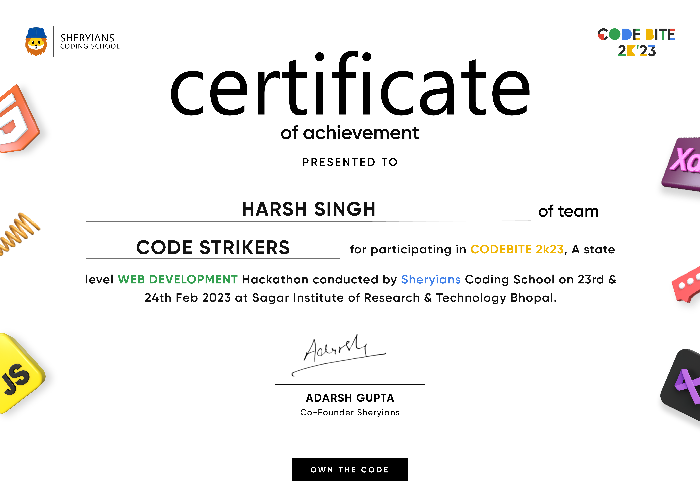

# Portfolio & Achievements 🏆

Welcome to my professional portfolio! Here you'll find my certifications, achievements, and professional development journey.

## 📜 Certifications

<details>
<summary>AWS Certifications</summary>

### AWS Essentials
- **Issuing Organization:** ITE Infotech Pvt Ltd.
- **Date:** October 2022
- **Certificate ID:** 2021/IN/2182
- **Skills:** Cloud Computing, AWS Fundamentals
  


</details>

<!-- Add more certification categories as needed -->
<details>
<summary>Other Technical Certifications</summary>

### Add Your Other Certifications Here
- **Issuing Organization:** [Organization Name]
- **Date:** [Completion Date]
- **Certificate ID:** [ID if applicable]
- **Skills:** [Relevant Skills]
  
<!-- Add image or PDF link -->


</details>

## 🏅 Achievements & Recognition

<details>
<summary>Professional Achievements</summary>

### Achievement Title
- **Description:** Brief description of the achievement
- **Date:** Achievement date
- **Impact:** What was the outcome or impact

</details>

<details>
<summary>Hackathons & Competitions</summary>

### CodeBite 2k23 - Web Development Hackathon
- **Team:** Code Strikers
- **Event:** State Level Web Development Hackathon
- **Organizer:** Sheryians Coding School
- **Venue:** Sagar Institute of Research & Technology, Bhopal
- **Date:** February 23-24, 2023



</details>

## 📚 Training & Workshops

<details>
<summary>Technical Training</summary>

### Training/Workshop Name
- **Organization:** Training provider
- **Duration:** Time period
- **Key Learnings:** Main takeaways

</details>

## 🔧 Skills Overview

### Technical Skills
- Cloud Computing (AWS)
- Web Development
- [Add more skills]

### Professional Skills
- [Add your professional skills]

---

> 💡 This portfolio is regularly updated with new certifications and achievements.

## 📁 Directory Structure
```bash
portfolio/
├── README.md
├── certificates/
│   ├── aws-essentials.png
│   ├── code-bite-Harsh_Singh.png
│   └── [other-certificates]
```

</details>

## 🤝 Connect With Me
- [LinkedIn](https://www.linkedin.com/in/harshsingh-io)
- [Portfolio](https://harshsinghh.me/portfolio/)
